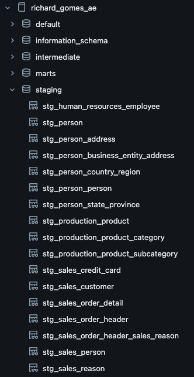
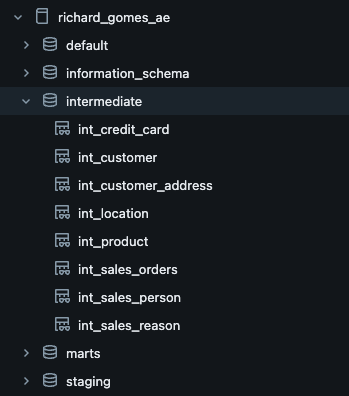
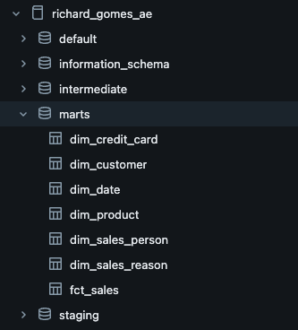
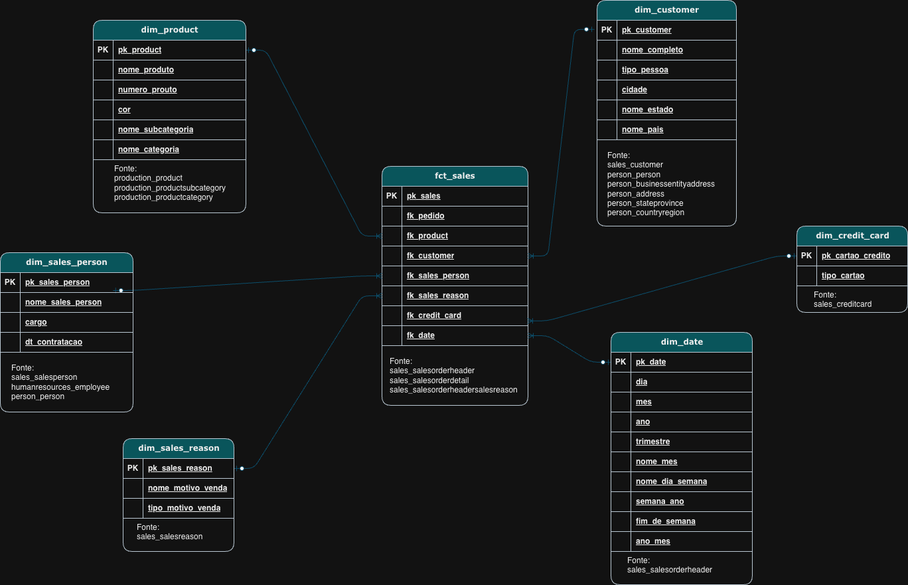
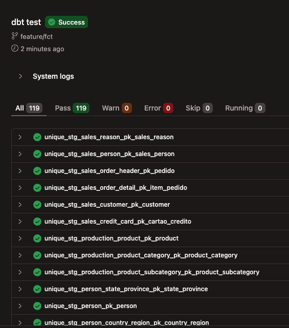
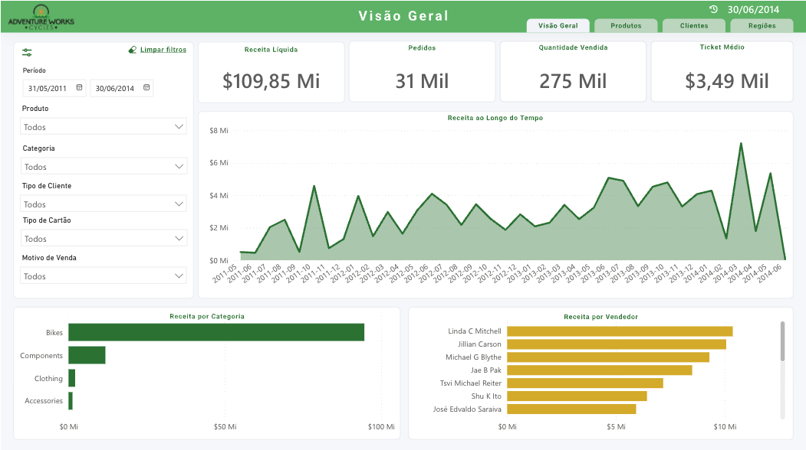
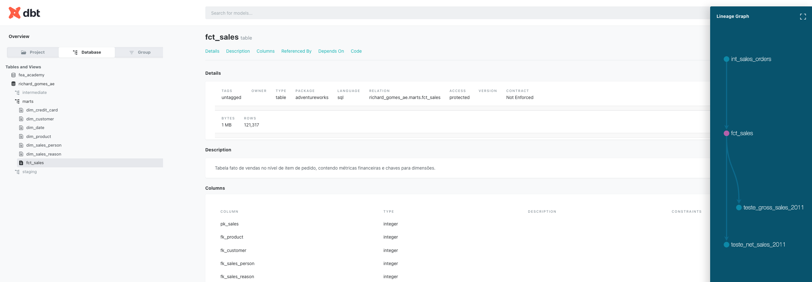
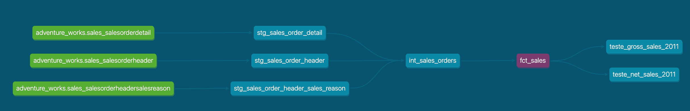

# Adventure Works - Analytics Engineering Project

Projeto desenvolvido como parte da **Certificação em Engenharia de Analytics (Indicium)**, com foco na construção de um pipeline moderno de dados utilizando o Modern Data Stack.

---

# Acesso ao Dashboard Interativo: [Visualizar Dashboard](https://app.powerbi.com/view?r=eyJrIjoiNjJiOWZiOWQtM2QzZi00MWQ2LWE1YzgtOTUzYzkwN2I1OWU0IiwidCI6IjcyOWI2MzAwLTQzMmMtNDUxZS1hMDRhLTQxZjBmNWY2NzY5NCJ9)

---

##  Objetivo

Construir um Data Warehouse analítico a partir dos dados da Adventure Works, permitindo responder perguntas de negócio através de modelagem dimensional e visualização em BI.

---

##  Arquitetura do Projeto

O projeto segue a arquitetura clássica do **dbt (ELT)**:

```
RAW → STAGING → INTERMEDIATE → MARTS → BI
```

---

##  Pipeline de Dados

### Staging (stg_)
Limpeza, padronização e tipagem dos dados brutos.



---

### Intermediate (int_)
Aplicação de regras de negócio e joins entre tabelas.



---

### Marts (dim_ e fct_)
Modelagem dimensional em formato estrela (Star Schema).



---

##  Modelo Dimensional

### Fato:
- `fct_sales` → granularidade em nível de item de pedido

### Dimensões:
- `dim_product`
- `dim_customer`
- `dim_sales_person`
- `dim_sales_reason`
- `dim_date`
- `dim_credit_card`

###  Diagrama do Modelo

Star Schema


---

##  Métricas Principais

- Receita bruta
- Receita líquida
- Quantidade vendida
- Ticket médio
- Número de pedidos

---

##  Testes de Dados

O projeto inclui testes para garantir qualidade e confiabilidade dos dados:

- `not_null`
- `unique`
- `relationships`
- Testes de consistência de métricas (ex: validação de faturamento)

###  Execução dos Testes


---

##  Tecnologias Utilizadas

- **dbt Cloud**
- **Databricks**
- **SQL**
- **Power BI**

---

##  Dashboard

O dashboard foi desenvolvido no Power BI com foco em análise exploratória e tomada de decisão.

###  Acesso ao Dashboard Interativo:

[Visualizar Dashboard](https://app.powerbi.com/view?r=eyJrIjoiNjJiOWZiOWQtM2QzZi00MWQ2LWE1YzgtOTUzYzkwN2I1OWU0IiwidCI6IjcyOWI2MzAwLTQzMmMtNDUxZS1hMDRhLTQxZjBmNWY2NzY5NCJ9)


###  Preview do Dashboard


---

##  Estrutura do Projeto

```
models/
├── staging/
├── intermediate/
├── marts/
```

---

##  Como Executar

```bash
dbt run
dbt test
```

---

##  Diferenciais do Projeto

- Modelagem seguindo boas práticas de Analytics Engineering
- Estrutura em camadas (staging, intermediate, marts)
- Separação clara entre transformação e consumo
- Projeto pronto para integração com ferramentas de BI
- Foco em escalabilidade e organização

---
##  Documentação do dbt





---
## Autor

Richard Gomes  
Projeto desenvolvido para fins educacionais e portfólio profissional